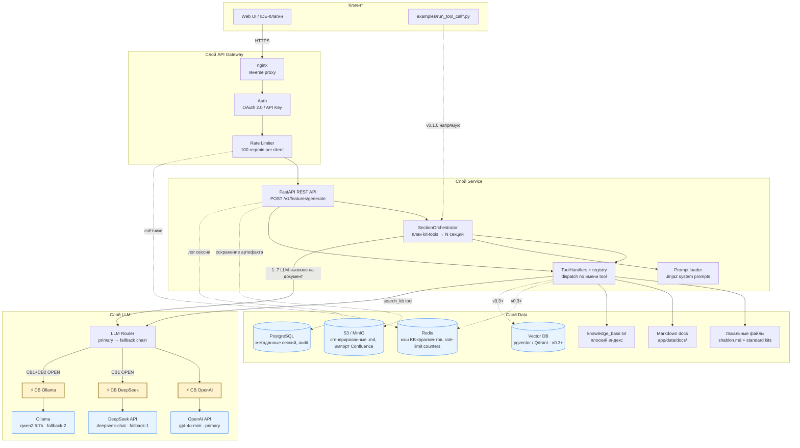
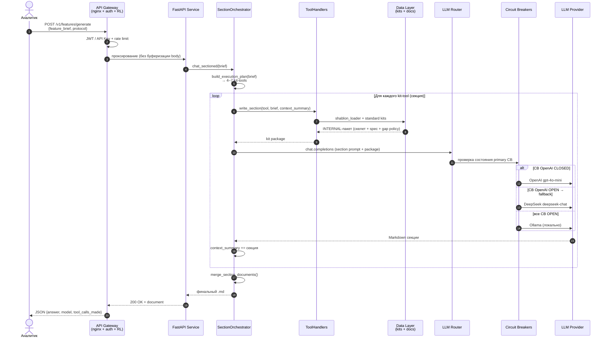

# Архитектура DocIntel (m3_b1)

**DocIntel** — AI-ассистент системного аналитика с циклом **LLM tool calling**: генерация документации фичи по корпоративному шаблону и standard kits, поиск по проектной документации (заглушка в v0.1.0).

Документ описывает **целевую production-архитектуру** дипломного проекта и отмечает, что уже реализовано в коде (`v0.1.0` — CLI/Python API без HTTP-слоя).

---

## Диаграмма компонентов



**Условные обозначения**

| Символ | Значение |
|--------|----------|
| ⚡ CB | Circuit Breaker (один экземпляр на провайдера) |
| Сплошная стрелка | Реализовано или заложено в текущем коде |
| Пунктир | Планируется в дорожной карте (v0.2–v1.0) |

---

## Поток одного запроса: генерация документации фичи

Сценарий: аналитик отправляет **feature brief** → получает **единый Markdown-документ**.



**Соответствие коду (v0.1.0):** шаги 8–22 реализованы в `SectionOrchestrator` + `ToolCallClient`; шаги 1–4 — CLI-скрипты вызывают оркестратор напрямую, минуя Gateway.

---

## Точки отказоустойчивости на схеме

| # | Точка | Механизм | Где в коде / план |
|---|-------|----------|-------------------|
| 1 | **Rate Limiter** (Gateway) | Ограничение 100 req/min → HTTP 429 | План: nginx `limit_req` + Redis-счётчики |
| 2 | **Auth fallback** | При недоступности IdP — отказ closed (401), без анонимного доступа | План: Gateway |
| 3 | **CB OpenAI** | Порог 50% ошибок за 30 с → OPEN, cooldown 60 с | План: `app/llm/router.py` |
| 4 | **CB DeepSeek** | Отдельный CB; срабатывает при 402/5xx/timeout | План: тот же router |
| 5 | **CB Ollama** | Последний резерв; CB защищает от бесконечных retry к мёртвому localhost | План: тот же router |
| 6 | **Fallback chain** | primary → DeepSeek → Ollama | Реализовано: ручной выбор `provider=` в `ToolCallClient` |
| 7 | **Sectioned orchestration** | 4–7 коротких вызовов вместо одного гигантского контекста | ✅ `section_orchestrator.py` |
| 8 | **Timeout per section** | `SUPPORT_TIMEOUT_SECONDS` (рекомендуется 180–300 с) | ✅ `config.py` |
| 9 | **GAP-политики** | Неизвестные факты → `GAP-*`, не галлюцинации | ✅ `gap_policies.py` |
| 10 | **Кэш KB** (Data) | Redis cache-aside для фрагментов docs | План: v0.3 |
| 11 | **Read replica PG** | При падении primary БД — read-only режим истории | План: v1.0 |

---

## ADR-001: Паттерн взаимодействия клиента с сервисом

**Status:** Accepted  
**Date:** 2026-06-19

### Context

| Параметр | Значение |
|----------|----------|
| **Сценарий** | **Агент с tool calling** — не чат-бот общего назначения. Основной flow: по brief строится план kit-tools, для каждой секции вызывается handler (данные из kits) + LLM (генерация Markdown). Вспомогательно: `search_kb` (FAQ/RAG-поиск по docs — сейчас заглушка). |
| **Нагрузка (целевая)** | 5–20 RPM на инстанс (команда 10–30 аналитиков, пик утром). Не batch-pipeline. |
| **TPM (оценка)** | ~150–400 K TPM при sectioned-режиме: 4–7 вызовов × ~20–40 K input + ~2–5 K output на секцию. |
| **Средний размер ответа** | **8–25 KB Markdown** (~3 000–8 000 output tokens), время генерации **3–8 мин** (primary) / **10–20 мин** (Ollama). |
| **SLA UX** | Аналитик ждёт готовый документ; промежуточный стриминг секций — nice-to-have, не blocker. |

### Decision

Выбран паттерн **Request-Response (синхронный HTTP)** на границе клиент ↔ API, с **внутренней последовательной оркестрацией** (sequential agent loop), а не Queue и не Streaming.

**Почему:**

1. Один brief → один артефакт (.md); пользователю нужен **целый документ**, а не поток токенов.
2. Sectioned-режим уже разбивает работу на 4–7 коротких LLM-вызовов — это снижает риск timeout одного монолитного запроса без усложнения инфраструктуры очередями.
3. Нагрузка низкая (десятки RPM), batch-обработка не требуется.
4. Tool calling требует **полного ответа модели** (function call / JSON arguments) перед dispatch handler — streaming усложняет парсинг tool calls.

### Consequences

**Выиграно:**

- Простая интеграция: один POST → один JSON с `answer`.
- Предсказуемая отладка и воспроизводимость (логируем plan + model per section).
- Не нужны worker’ы, брокер сообщений, polling статуса job.

**Усложнилось / trade-offs:**

- Длинный HTTP-request (до 8 мин) → нужен **увеличенный `proxy_read_timeout`** в nginx (≥ 600 s) и async endpoint или connection keep-alive.
- Клиент не видит прогресс «секция 3 из 7» без дополнительного паттерна (SSE/WebSocket).
- При обрыве соединения вся генерация теряется — mitigation: idempotency key + сохранение черновиков секций в Redis/Postgres (v0.4+).

### Alternatives considered

| Паттерн | Почему отвергнут |
|---------|------------------|
| **Streaming (SSE)** | UX-выигрыш (показ секций по мере готовности) не оправдывает сложность: SSE + отключение буферизации nginx (`proxy_buffering off`, `X-Accel-Buffering: no`), несовместимость с native tool calling в одном round-trip, нужен отдельный протокол «стрим секций». |
| **Queue + Workers** | Имеет смысл при >100 RPM или multi-tenant SaaS. Для диплома добавляет Celery/RQ, poller «GET /jobs/{id}», dead-letter queue — избыточно при 5–20 RPM. |
| **Fan-out (параллельные секции)** | Сократило бы latency, но **ломает `context_summary`**: секции TO BE зависят от AS IS и requirements. Параллель только для независимых kits (observability ∥ data model) — отложено на v0.4. |
| **Batch (ночной прогон)** | Не подходит: аналитик работает интерактивно с brief. |

---

## ADR-002: Стратегия fault tolerance для LLM-провайдеров

**Status:** Accepted (частично реализовано)  
**Date:** 2026-06-19

### Context

DocIntel критически зависит от LLM. Отказ провайдера не должен блокировать работу аналитика полностью. Sectioned-режим умножает число вызовов (4–7×), повышая вероятность хотя бы одного timeout.

### Decision

| Роль | Провайдер | Модель | Обоснование |
|------|-----------|--------|-------------|
| **Primary** | OpenAI API | `gpt-4o-mini` | Лучшее качество tool calling и русскоязычных артефактов при приемлемой цене |
| **Fallback-1** | DeepSeek API | `deepseek-chat` | Облачный резерв при недоступности OpenAI; OpenAI-compatible API |
| **Fallback-2** | Ollama (local) | `qwen2.5:7b` | Air-gap / zero cloud cost; работает без интернета |

**Circuit Breaker — один на провайдера:**

```
OpenAI  ──[CB: 50% errors / 30s window, cooldown 60s]──► DeepSeek
DeepSeek ──[CB: отдельный экземпляр]────────────────────► Ollama
Ollama  ──[CB: отдельный экземпляр]────────────────────► template/GAP-only ответ
```

**Триггеры OPEN:** `APITimeoutError`, `APIConnectionError`, HTTP 429/502/503/504, `AuthenticationError` (не retry), 402 Insufficient Balance (DeepSeek).

**Реализация v0.1.0:** выбор провайдера вручную через `ToolCallClient(provider="primary"|"fallback")` и `FALLBACK_BACKEND=ollama|deepseek`. Автоматический router + CB — **целевой модуль** `app/llm/router.py` (см. дорожную карту).

### Consequences

**Выиграно:**

- Graceful degradation: облако → другой облачный API → локальная модель.
- CB предотвращает каскадные timeout’ы (sectioned × 7 вызовов).
- Единый OpenAI SDK для всех backend’ов (`base_url` switching).

**Усложнилось:**

- Три набора credentials и мониторинг (`llm_provider_errors_total`, `circuit_breaker_state`).
- Качество fallback-моделей ниже → больше `GAP-*`, нужен `text_tool_calls` parser для моделей без native tools.
- Ollama требует GPU/CPU на хосте; cloud-модели Ollama — платная подписка.

### Alternatives considered

| Альтернатива | Почему отвергнута |
|--------------|-------------------|
| **Anthropic как primary** | Не выбран primary: текущий код и kits заточены под OpenAI tool schema; Anthropic — опциональный провайдер v1.0 (отдельный adapter). |
| **Round-robin между провайдерами** | Непредсказуемое качество документа; нарушает воспроизводимость. |
| **Retry без CB** | При падении OpenAI 7 секций × 3 retry = минуты wasted latency и risk rate limit ban. |
| **Только Ollama** | Недостаточное качество Use Case и integration-разделов для корпоративного шаблона. |

---

## Потенциальные точки отказа

### API Gateway

| При выпадении | Паттерн смягчения | Graceful degradation |
|---------------|-------------------|----------------------|
| nginx / LB недоступен | Health checks + второй ingress; DNS failover | Клиент получает 502; retry с exponential backoff. CLI v0.1.0 продолжает работать напрямую с Python API. |
| Auth (IdP) недоступен | Cached JWKS + короткий TTL; API keys как backup auth | **Closed failure:** 401, генерация не начинается (нет анонимного доступа к brief). |
| Rate limiter (Redis) недоступен | Fail-open с локальным in-memory лимитом на pod | Пропускает чуть больше трафика, но сервис жив; алерт ops. |

### Service

| При выпадении | Паттерн смягчения | Graceful degradation |
|---------------|-------------------|----------------------|
| FastAPI / orchestrator crash | 2+ replicas, K8s liveness/readiness | Retry POST; при повторном падении — 503. |
| `build_execution_plan` не нашёл секций | Валидация brief на Gateway | Ответ 422 с подсказкой («добавьте ключевые слова: Kafka, REST…»). |
| Превышен `max_tool_rounds` (chat-режим) | Sectioned-режим по умолчанию | Сообщение «не удалось завершить диалог» + partial save (план). |
| OOM на большом brief | Лимит размера body 32 KB; sectioned split | 413 Payload Too Large. |

### LLM

| При выпадении | Паттерн смягчения | Graceful degradation |
|---------------|-------------------|----------------------|
| **OpenAI недоступен** | CB OPEN → DeepSeek | Прозрачный fallback; в ответе `model: deepseek-chat`. |
| **DeepSeek недоступен / 402 balance** | CB OPEN → Ollama | Локальная генерация; качество ↓, больше GAP. |
| **Все провайдеры недоступны** | CB все OPEN | Возврат **скелета из kits без LLM-fill** + сообщение «автозаполнение недоступно, отредактируйте GAP вручную». |
| Timeout одной секции | Per-section timeout + retry 1× на fallback | Частичный документ: готовые секции + placeholder для failed step. |
| Rate limit 429 от OpenAI | CB + exponential backoff → fallback | Переключение на DeepSeek без участия пользователя. |

### Data

| При выпадении | Паттерн смягчения | Graceful degradation |
|---------------|-------------------|----------------------|
| **Локальные kits / shablon.md** (текущий v0.1.0) | Git-versioned methodology; read-only mount | **Hard failure:** без kits генерация невозможна (500). |
| **Markdown docs (`app/data/docs/`)** | Реплика в S3; CI sync | `search_kb` возвращает «фрагменты не найдены»; генерация по brief продолжается. |
| **PostgreSQL** (метаданные, audit) | Read replica; async write log | Генерация работает; история сессий временно не сохраняется. |
| **Redis** (кэш KB) | Cache-aside: miss → read FS/Postgres | Latency search_kb +50–200 ms; функциональность сохранена. |
| **S3** (артефакты) | Local temp file + retry upload | Документ отдаётся в HTTP body; upload в фоне. |
| **Vector DB** (v0.3+) | Fallback на token overlap (`search_kb` v0.1.0) | Семантический поиск ↓; keyword search остаётся. |

---

## Маппинг на текущий код (v0.1.0)

| Компонент на диаграмме | Файл / модуль | Статус |
|------------------------|---------------|--------|
| SectionOrchestrator | `app/llm/section_orchestrator.py` | ✅ |
| ToolCallClient | `app/llm/client.py` | ✅ |
| ToolHandlers / registry | `app/tools/registry.py` | ✅ |
| Primary / fallback credentials | `app/llm/providers.py` | ✅ |
| Standard kits + shablon | `feature-methodology-project/` | ✅ |
| search_kb (token overlap) | `app/tools/search_kb/handler.py` | ⚠️ заглушка |
| LLM Router + Circuit Breaker | — | 🔜 план |
| API Gateway (nginx) | — | 🔜 план |
| PostgreSQL / Redis / S3 | — | 🔜 v0.3–v1.0 |

---

## Связанные документы

- [README.md](../README.md) — установка, tools, переменные окружения
- [Дорожная карта](../README.md#дорожная-карта-планируемые-версии) — v0.2 … v1.0
